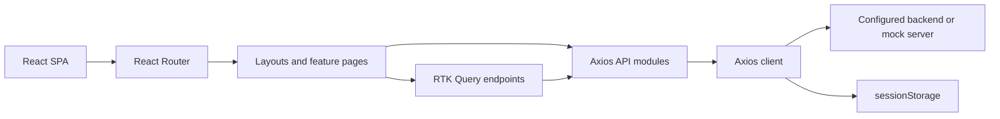
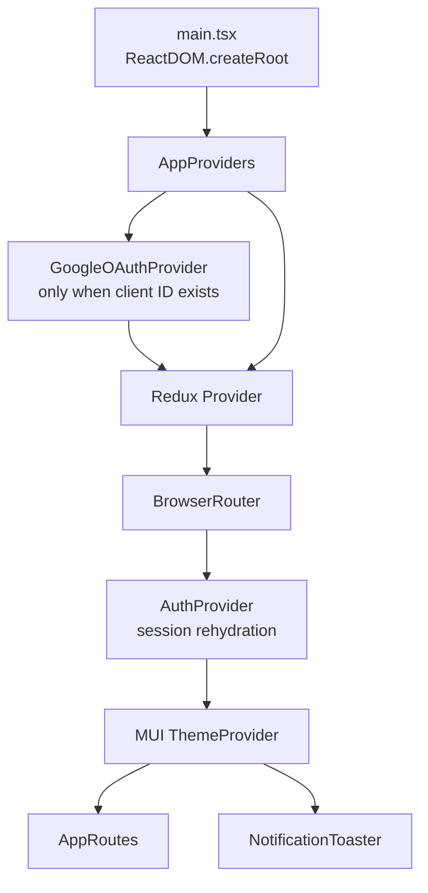
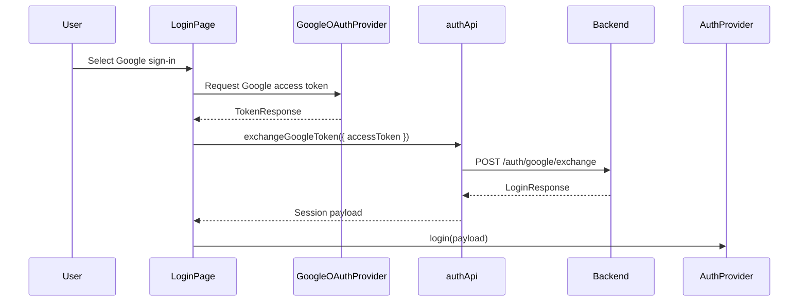
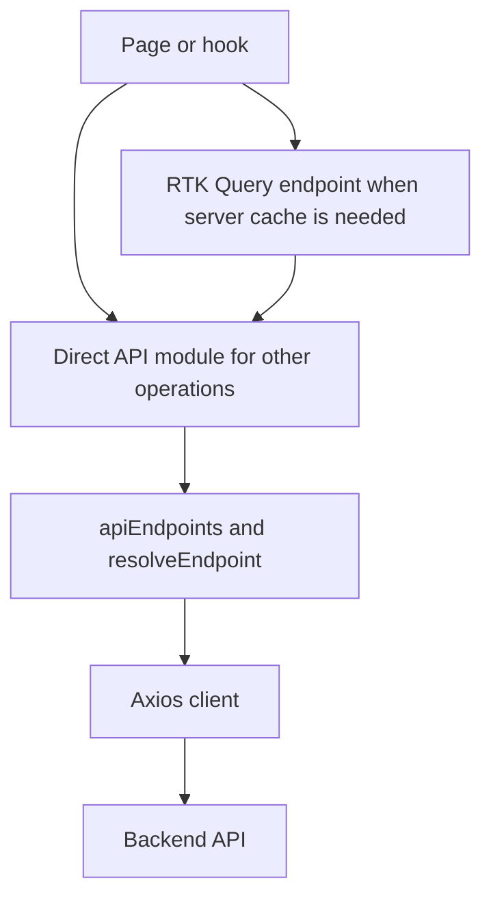
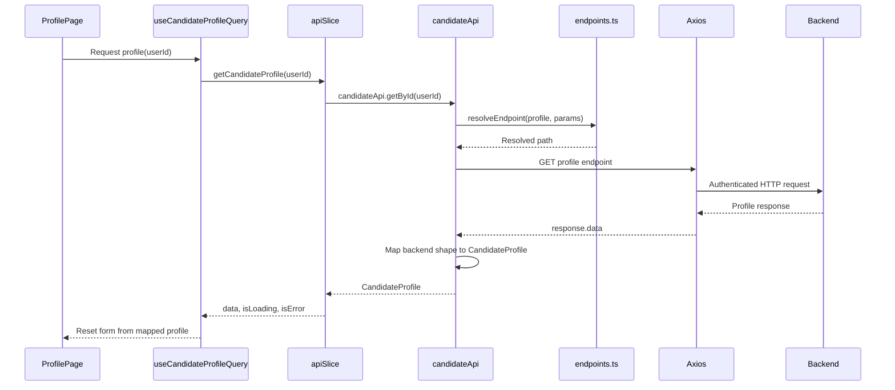
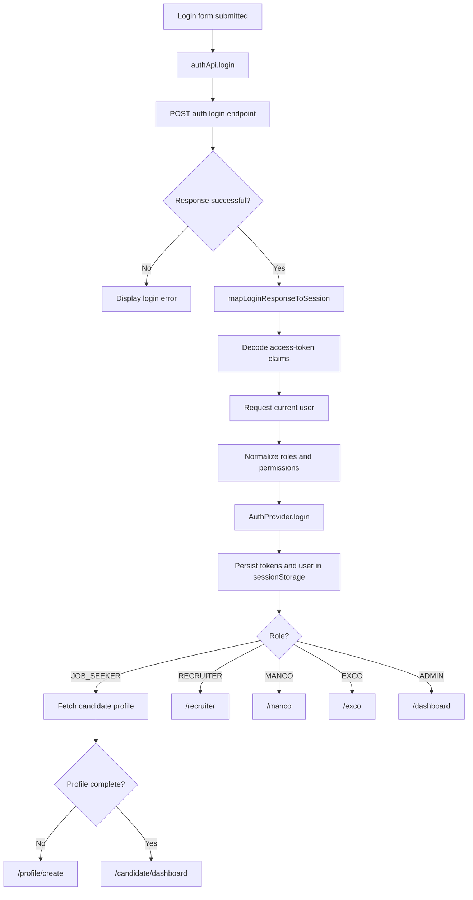
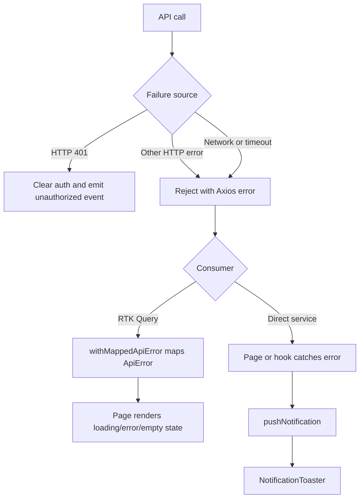

# SkillsMine Frontend Architecture

This document describes the current frontend runtime, route composition, authentication model, API boundary, state ownership, and configuration. It is intended for contributors and maintainers. The repository README covers setup and common commands.

## Table of Contents

1. [System Overview](#system-overview)
2. [Bootstrap and Providers](#bootstrap-and-providers)
3. [Routes and Access Control](#routes-and-access-control)
4. [Authentication and Session State](#authentication-and-session-state)
5. [API Layer](#api-layer)
6. [State Ownership](#state-ownership)
7. [Feature Structure](#feature-structure)
8. [Endpoint Configuration](#endpoint-configuration)
9. [Data Flows](#data-flows)
10. [Error Handling](#error-handling)
11. [Testing and Verification](#testing-and-verification)
12. [Design Decisions](#design-decisions)

## System Overview



The application is a client-rendered React 19 SPA. `src/main.tsx` mounts the application; `src/routes/AppRoutes.tsx` owns route composition; API requests use Axios and the configured backend base URL. There is no server-side rendering in this project.

## Bootstrap and Providers

The provider order in `src/app/AppProviders.tsx` is:

1. Redux `Provider`
2. `BrowserRouter`
3. `AuthProvider`
4. Material UI `ThemeProvider` and `CssBaseline`
5. Application routes and the global `NotificationToaster`

`GoogleOAuthProvider` wraps this tree only when `VITE_GOOGLE_CLIENT_ID` is present. The application therefore remains usable without Google OAuth configuration; the Google action reports that configuration is missing.

Routes are wrapped in `Suspense` because feature pages are lazy-loaded. A shared route fallback is rendered while a page bundle is loading.



## Routes and Access Control

Public routes are rendered by `PublicLayout`:

| Route | Page |
|---|---|
| `/` | Landing page |
| `/login` | Login |
| `/signup` | Sign-up |
| `/reset-password` | Password reset |

All other application routes are children of `ProtectedRoute`. Role-specific and shared routes are composed with these layouts:

| Layout | Routes and guard |
|---|---|
| `CandidateLayout` | `/candidate/dashboard`, `/candidate/cv-builder`, `/profile/create` are restricted to `JOB_SEEKER`; `/jobs`, `/jobs/latest`, `/jobs/saved`, `/jobs/recommended`, `/jobs/:jobId`, and `/profile` are candidate-facing routes |
| `RecruiterLayout` | `/recruiter`, `/recruiter/job-posts`, `/recruiter/new-job-post`, `/recruiter/edit-job-post/:mandateId`, `/recruiter/mandate/:cardId`, `/recruiter/mandate/:cardId/candidate/:candidateId`, `/recruiter/candidates`, `/recruiter/candidates/:candidateId`, `/recruiter/crm`, and `/recruiter/manco` |
| `PermissionGuard` | `/crm` requires `CRM_EDIT` |
| `MancoLayout` | `/manco` requires `MANCO` or `ADMIN` |
| `ExcoLayout` | `/exco` requires `EXCO` or `ADMIN` |
| `AdminLayout` | `/dashboard` requires `ADMIN` |

### Route Composition Diagram

```mermaid
flowchart TD
  root["AppRoutes"]
  public["PublicLayout"]
  landing["/"]
  login["/login"]
  signup["/signup"]
  reset["/reset-password"]
  protected["ProtectedRoute"]

  candidate["CandidateLayout"]
  candidateGuard["RoleGuard: JOB_SEEKER"]
  candidateDashboard["/candidate/dashboard"]
  cvBuilder["/candidate/cv-builder"]
  profileCreate["/profile/create"]
  jobs["Candidate job routes\n/jobs, /jobs/latest, /jobs/saved, /jobs/recommended"]
  jobDetails["/jobs/:jobId"]
  profile["/profile"]

  recruiter["RecruiterLayout"]
  recruiterHome["/recruiter"]
  jobPosts["/recruiter/job-posts"]
  newJobPost["/recruiter/new-job-post"]
  editJobPost["/recruiter/edit-job-post/:mandateId"]
  mandate["/recruiter/mandate/:cardId"]
  recruiterCandidate["/recruiter/mandate/:cardId/candidate/:candidateId"]
  candidates["/recruiter/candidates\nand /recruiter/candidates/:candidateId"]
  recruiterCrm["/recruiter/crm"]
  recruiterManco["/recruiter/manco"]
  crmGuard["PermissionGuard: CRM_EDIT"]
  crm["/crm"]

  mancoLayout["MancoLayout"]
  mancoGuard["RoleGuard: MANCO | ADMIN"]
  manco["/manco"]
  excoLayout["ExcoLayout"]
  excoGuard["RoleGuard: EXCO | ADMIN"]
  exco["/exco"]
  adminLayout["AdminLayout"]
  adminGuard["RoleGuard: ADMIN"]
  dashboard["/dashboard"]
  fallback["Unknown path -> /"]

  root --> public
  public --> landing
  public --> login
  public --> signup
  public --> reset
  root --> protected

  protected --> candidate
  candidate --> candidateGuard
  candidateGuard --> candidateDashboard
  candidateGuard --> cvBuilder
  candidateGuard --> profileCreate
  candidate --> jobs
  candidate --> jobDetails
  candidate --> profile

  protected --> recruiter
  recruiter --> recruiterHome
  recruiter --> jobPosts
  recruiter --> newJobPost
  recruiter --> editJobPost
  recruiter --> mandate
  recruiter --> recruiterCandidate
  recruiter --> candidates
  recruiter --> recruiterCrm
  recruiter --> recruiterManco
  recruiter --> crmGuard
  crmGuard --> crm

  protected --> mancoLayout
  mancoLayout --> mancoGuard --> manco
  protected --> excoLayout
  excoLayout --> excoGuard --> exco
  protected --> adminLayout
  adminLayout --> adminGuard --> dashboard
  root --> fallback
```



`ProtectedRoute` redirects unauthenticated users to `/login` and preserves the attempted location. During initial auth hydration it can use valid persisted session data. `RoleGuard` and `PermissionGuard` use the authenticated user from `AuthContext`; failed checks use their configured fallback behavior. The canonical path constants are in [src/routes/routePaths.ts](src/routes/routePaths.ts).

Default destinations are defined in [src/routes/roleDefaultRoutes.ts](src/routes/roleDefaultRoutes.ts):

```text
JOB_SEEKER -> /candidate/dashboard
RECRUITER  -> /recruiter
MANCO      -> /manco
EXCO       -> /exco
ADMIN      -> /dashboard
```

Unknown paths redirect to `/`.

## Authentication and Session State

`AuthProvider` owns the in-memory session and exposes `useAuth()`, `login`, `logout`, `hasRole`, and `hasPermission`. On mount it reads `skillsmine.auth.tokens` and `skillsmine.auth.user` from `sessionStorage`. A missing user, missing access token, or expired JWT clears the stored session.

Logout clears auth storage, candidate state, auth state, and the RTK Query cache. The Axios 401 interceptor also clears authentication through the auth event boundary; navigation is then handled by route protection.

The login flow calls `/auth/me` after login when possible to build the current user. If that request is unavailable, it falls back to claims from the access-token JWT. Candidate login then checks profile data and routes to `/profile/create` when incomplete or `/candidate/dashboard` when complete. Other roles use their default route.

Supported roles are `JOB_SEEKER`, `RECRUITER`, `MANCO`, `EXCO`, and `ADMIN`. Permissions are derived once from roles in `src/services/api/authApi.ts`; `ADMIN` expands to all known permissions. The browser currently stores tokens in session storage, so a production hardening plan should consider short-lived in-memory access tokens and refresh tokens in secure HttpOnly cookies.

### Role Permissions

| Role | Derived permissions |
|---|---|
| `JOB_SEEKER` | `VIEW_JOBS`, `APPLY_JOB`, `UPLOAD_CV`, `VIEW_DASHBOARD` |
| `RECRUITER` | `MANDATE_CREATE`, `MANDATE_EDIT`, `PIPELINE_ADVANCE`, `CRM_EDIT`, `CANDIDATE_VIEW`, `VIEW_DASHBOARD` |
| `MANCO` | `PIPELINE_VIEW`, `REPORT_VIEW`, `RECRUITER_VIEW`, `VIEW_DASHBOARD` |
| `EXCO` | `PIPELINE_VIEW`, `REPORT_VIEW`, `RECRUITER_VIEW`, `VIEW_DASHBOARD` |
| `ADMIN` | `ALL`, expanded to every permission in `PERMISSIONS` |

### Google OAuth Flow



## API Layer



The API boundary is split deliberately:

- `src/services/api/axios.ts` creates the Axios client, applies the base URL and timeout, and attaches the bearer token from session storage.
- `src/services/api/endpoints.ts` resolves endpoint templates from `VITE_*` variables and hardcoded defaults. Dynamic `:param` values are URI encoded by `resolveEndpoint`.
- `src/services/api/*.ts` contains domain service modules and response mapping.
- `src/store/api/apiSlice.ts` exposes RTK Query endpoints for server state that benefits from caching, invalidation, optimistic updates, or pagination.

Current service modules include `authApi`, `candidateApi`, `jobsApi`, `industryApi`, `mandateApi`, `recruiterCandidatesApi`, and `crmApi`. Candidate profile, dashboard, user-profile, skills, CV, and paginated jobs operations are represented in RTK Query. Remaining domain operations may call the service modules directly.

API errors from RTK Query operations are normalized by `withMappedApiError` in `src/store/api/queryHelpers.ts`. Pages either render inline error states or dispatch a notification through `NotificationToaster`.

### Axios Client Behavior

- Base URL: `VITE_API_BASE_URL`, defaulting to `/api`.
- Timeout: `VITE_REQUEST_TIMEOUT_MS`, defaulting to 5000 milliseconds.
- Request interceptor: reads `skillsmine.auth.tokens` and adds `Authorization: Bearer <accessToken>` when available.
- Response interceptor: clears auth storage on HTTP 401 and emits the unauthorized event; it does not perform router navigation itself.

### Service Module Responsibilities

| Module | Responsibility |
|---|---|
| `authApi.ts` | Login, current user, Google exchange, candidate/staff registration, invitation validation, password recovery, reset/change password, logout |
| `candidateApi.ts` | Candidate landing/dashboard, profile, CV build, resume preview/download, recommended/saved jobs, AI actions, application uploads and stage transitions |
| `jobsApi.ts` | Job listing, details, save, apply, and job creation operations |
| `mandateApi.ts` | Recruiter dashboard, legacy mandate operations, job-post CRUD, mandate/candidate detail, pipeline, application stage, and MANCO operations |
| `industryApi.ts` | Industry catalog for recruiter job-post forms |
| `recruiterCandidatesApi.ts` | Recruiter candidate directory and filters |
| `crmApi.ts` | CRM clients and client notes |

### Endpoint Resolution

```mermaid
graph LR
  env[".env / VITE_* keys"] --> config[apiEndpoints]
  config --> resolve[resolveEndpoint(template, params)]
  resolve --> service[Service modules]
  service --> axios[Axios client]
```

For example:

```ts
resolveEndpoint('/users/:userId', { userId: 'USR100001' })
// '/users/USR100001'
```

Template parameters are URI encoded. Templates without matching parameters are left unchanged. Defaults are evaluated from `import.meta.env` when `apiEndpoints` is created, making endpoint overrides explicit and centralized.

## State Ownership

The Redux store in `src/store/index.ts` contains:

| State | Responsibility |
|---|---|
| `auth` | Legacy/auth slice state used by existing flows |
| `candidate` | Candidate dashboard identity, saved and recommended job IDs, and profile/CV flags |
| `permission` | Permission token state |
| `recruiterPipeline` | Recruiter pipeline selections, stages, notes, and documents |
| `ui` | Cross-cutting UI state such as landing mode |
| `notification` | Global toast queue |
| `api` | RTK Query reducer and server cache |

Use RTK Query for remote data and cache invalidation. Use slices for cross-page client state or transient UI state. Do not create a second Redux mirror of data already owned by RTK Query.

### RTK Query Endpoint Inventory

| Endpoint | Cache/invalidation role | Main consumers |
|---|---|---|
| `getCandidateProfile(userId)` | `CandidateProfile:{userId}` | Profile and CV builder |
| `getCandidateDashboard()` | `CandidateDashboard:SELF` | Candidate dashboard |
| `updateCandidateProfile({ userId, payload })` | Invalidates profile and dashboard | Profile save |
| `listJobsPage({ searchQuery, page, pageSize })` | Page/query-specific jobs tags | Public and candidate jobs feeds |
| `getUserProfile(userId)` | `UserProfile:{userId}` | Saved/recommended job hydration |
| `saveJob({ userId, savedJobs })` | Invalidates user profile | Optimistic save/unsave actions |
| `searchSkills({ keyword, userId })` | `Skills:{keyword}` | Profile skills search |
| CV queries and mutations | `BuildMyCv:SELF` | CV builder |

RTK Query query functions call the existing service modules and pass failures through `withMappedApiError`. This keeps HTTP transport and response mapping reusable while giving selected pages cache lifecycle, pagination, and invalidation behavior.

## Feature Structure

```text
src/
  app/          Providers, auth context, JWT, storage, shared validation
  assets/       Feature assets
  components/  Reusable UI components
  hooks/        Reusable hooks such as debounced search state
  layouts/      Public and role-specific shells
  modules/      Domain pages, hooks, services, and types
  routes/       Route definitions, paths, and guards
  services/api/ Axios client, endpoint config, and transport modules
  store/        Redux slices and RTK Query API
  theme/        Material UI theme
  types/        Shared TypeScript contracts
  workflow/     Pipeline workflow configuration and service
```

Feature pages should stay inside their domain module. Shared layout concerns belong in `layouts`, reusable controls belong in `components`, and backend-specific mapping belongs in the API service boundary.

### Detailed Source Tree

```text
src/
├── app/                    Providers, auth context, JWT, storage, validation
│   └── auth/               AuthContext, auth events, JWT helpers, tokenStorage
├── assets/                 Images and icons grouped by feature
├── components/             Shared UI primitives and notification surfaces
├── hooks/                  Shared hooks such as debounce and search state
├── layouts/                Public, candidate, recruiter, MANCO, EXCO, admin shells
├── modules/
│   ├── auth/               Login, sign-up, reset-password pages and forms
│   ├── candidate/          Dashboard, profile, jobs, job details, and candidate hooks
│   ├── crm/                CRM clients and notes
│   ├── cv-builder/         Multi-step CV builder and preview
│   ├── dashboard/          Admin dashboard entry
│   ├── exco/               EXCO entry
│   ├── manco/              MANCO entry
│   ├── public/             Landing page, public search, and sign-up drawers
│   └── recruiter/          Dashboard, mandates, job posts, candidates, and CRM
├── routes/                 AppRoutes, route paths, role and permission guards
├── services/api/           Axios client, endpoint config, service modules
├── store/                  Redux store, slices, selectors, RTK Query API
├── test/                   Vitest setup and shared test utilities
├── theme/                  Material UI design tokens
├── types/                  Shared API, auth, jobs, and common contracts
└── workflow/               Pipeline stage definitions and transitions
```

## Endpoint Configuration

All declared frontend environment keys are in [src/vite-env.d.ts](src/vite-env.d.ts). The most important runtime settings are:

| Variable | Default | Purpose |
|---|---|---|
| `VITE_API_BASE_URL` | `/api` | Axios base URL |
| `VITE_REQUEST_TIMEOUT_MS` | `5000` | Axios request timeout |
| `VITE_GOOGLE_CLIENT_ID` | none | Enables Google OAuth provider |
| `VITE_MOCK_ERROR_RATE` | mock-server setting | Error injection when supported by the mock server |
| `VITE_MOCK_DELAY_MIN_MS` | mock-server setting | Minimum mock response delay |
| `VITE_MOCK_DELAY_MAX_MS` | mock-server setting | Maximum mock response delay |

Endpoint overrides are grouped by resource in `apiEndpoints`:

```text
auth, admin, users, candidate, applications, jobs, industries,
skills, candidates, recruiter, pipeline, manco, jobPosts, crm
```

Relevant keys include auth registration/login/recovery, user profile, candidate dashboard/profile/CV/jobs, applications, jobs pagination, industries, skills search, recruiter and pipeline operations, management dashboards, job-post CRUD, and CRM clients/notes. Defaults and exact variable names live in `src/services/api/endpoints.ts`; update that file and `src/vite-env.d.ts` together when adding an override.

## Data Flows

### Candidate Profile Read and Save



The save path maps form values to the backend payload, calls the RTK Query mutation, and invalidates the candidate profile and dashboard tags. Candidate profile mapping remains in the service boundary so page components do not depend on backend envelope or field naming.

### Login and Session Establishment



The current-user request is preferred because it supplies server-authoritative identity and roles. JWT claims are the fallback when that request is unavailable. During the first render after login, route guards can read the persisted session while React context finishes hydration.

## Full Environment Variable Catalog

All variables are declared in [src/vite-env.d.ts](src/vite-env.d.ts) and resolved through [src/services/api/endpoints.ts](src/services/api/endpoints.ts). Every endpoint override is optional and has a default in `apiEndpoints`.

| Variable | Description | Default |
|---|---|---|
| `VITE_GOOGLE_CLIENT_ID` | Google OAuth web client ID | Optional; provider disabled when absent |
| `VITE_API_BASE_URL` | Backend API base URL | `/api` |
| `VITE_REQUEST_TIMEOUT_MS` | Axios timeout in milliseconds | `5000` |
| `VITE_MOCK_ERROR_RATE` | Mock error injection rate | Mock-server configuration |
| `VITE_MOCK_DELAY_MIN_MS` | Mock minimum delay | Mock-server configuration |
| `VITE_MOCK_DELAY_MAX_MS` | Mock maximum delay | Mock-server configuration |
| `VITE_AUTH_REGISTER_ENDPOINT` | Legacy registration endpoint | `/auth/register` |
| `VITE_AUTH_CANDIDATE_REGISTER_ENDPOINT` | Candidate registration endpoint | `/api/v1/auth/candidates/register` |
| `VITE_AUTH_STAFF_REGISTER_ENDPOINT` | Staff registration endpoint | `/api/v1/auth/staff/register` |
| `VITE_AUTH_STAFF_INVITATION_VALIDATE_ENDPOINT` | Staff invitation validation | `/api/v1/auth/staff-invitations/validate` |
| `VITE_AUTH_LOGIN_ENDPOINT` | Login | `/auth/login` |
| `VITE_AUTH_FORGOT_PASSWORD_ENDPOINT` | Forgot-password request | `/auth/forgot-password` |
| `VITE_AUTH_RESET_PASSWORD_ENDPOINT` | Reset password | `/api/v1/auth/reset-password` |
| `VITE_AUTH_CHANGE_PASSWORD_ENDPOINT` | Change password | `/auth/change-password` |
| `VITE_AUTH_LOGOUT_ENDPOINT` | Logout | `/auth/logout` |
| `VITE_AUTH_GOOGLE_EXCHANGE_ENDPOINT` | Google token exchange | `/auth/google/exchange` |
| `VITE_AUTH_ME_ENDPOINT` | Current-user lookup | `/api/v1/users/me` |
| `VITE_ADMIN_STAFF_INVITATIONS_ENDPOINT` | Admin staff invitations | `/api/v1/admin/staff-invitations` |
| `VITE_USERS_PROFILE_ENDPOINT` | User profile read/update | `/users/:userId` |
| `VITE_USERS_PROFILE_PHOTO_ENDPOINT` | Profile photo operations | `/users/:userId/profile-photo` |
| `VITE_CANDIDATE_LANDING_ENDPOINT` | Candidate landing data | `/candidates/landing` |
| `VITE_CANDIDATE_DASHBOARD_ENDPOINT` | Candidate dashboard | `/candidates/dashboard` |
| `VITE_CANDIDATE_PROFILE_ENDPOINT` | Candidate profile | `/candidates/profile/` |
| `VITE_CANDIDATE_BUILDMYCV_ENDPOINT` | Build CV | `/candidates/cv-build/` |
| `VITE_CANDIDATE_RESUME_PREVIEW_ENDPOINT` | Resume preview | `/candidate/:resumeId/preview` |
| `VITE_CANDIDATE_RESUME_DOWNLOAD_ENDPOINT` | Resume download | `/candidate/:resumeId/download` |
| `VITE_CANDIDATE_RECOMMENDED_JOBS_ENDPOINT` | Recommended jobs | `/candidates/recommended-positions` |
| `VITE_CANDIDATE_SAVED_JOBS_ENDPOINT` | Saved jobs | `/candidates/saved-jobs` |
| `VITE_CANDIDATE_SAVED_JOB_ENDPOINT` | Saved-job mutation | `/candidates/saved-jobs/:jobProfileId` |
| `VITE_CANDIDATE_AI_ACTIONS_ENDPOINT` | Candidate AI actions | `/candidates/ai-actions/` |
| `VITE_APPLICATION_CV_UPLOAD_ENDPOINT` | Application CV upload | `/applications/:applicationId/cv/upload` |
| `VITE_APPLICATION_STAGE_TRANSITION_ENDPOINT` | Candidate application stage transition | `/applications/:applicationId/stage-transition` |
| `VITE_RECRUITER_APPLICATION_STAGE_ENDPOINT` | Recruiter application stage update | `/recruiter/applications/:applicationId/stage` |
| `VITE_JOBS_ENDPOINT` | Job list/create | `/jobs` |
| `VITE_JOB_DETAILS_ENDPOINT` | Job details | `/jobs/:jobId` |
| `VITE_JOB_SAVE_ENDPOINT` | Save job | `/jobs/:jobId/save` |
| `VITE_JOB_APPLY_ENDPOINT` | Apply to job | `/jobs/:jobId/apply` |
| `VITE_JOBS_QUERY_PARAM` | Search query parameter | `q` |
| `VITE_JOBS_PAGE_PARAM` | Page parameter | `page` |
| `VITE_JOBS_PAGE_SIZE_PARAM` | Optional page-size parameter declaration | Declared for compatibility |
| `VITE_JOBS_LIMIT_PARAM` | Page limit parameter | `limit` |
| `VITE_OPPORTUNITIES_ENDPOINT` | Public opportunities endpoint declaration | Declared for compatibility |
| `VITE_INDUSTRIES_LIST_ENDPOINT` | Industry catalog | `/industries` |
| `VITE_SKILLS_SEARCH_ENDPOINT` | Skills search | `/skills/search` |
| `VITE_SKILLS_SEARCH_KEYWORD_PARAM` | Skills keyword parameter | `keyword` |
| `VITE_SKILLS_SEARCH_LIMIT_PARAM` | Skills limit parameter | `limit` |
| `VITE_CANDIDATES_LIST_ENDPOINT` | Recruiter candidate directory | `/candidates` |
| `VITE_RECRUITER_DASHBOARD_ENDPOINT` | Recruiter dashboard | `/recruiter/dashboard` |
| `VITE_RECRUITER_MANDATES_ENDPOINT` | Legacy mandate operations | `/recruiter/mandates` |
| `VITE_RECRUITER_CANDIDATES_SEARCH_ENDPOINT` | Recruiter candidate search | `/recruiter/candidates/search` |
| `VITE_MANDATE_DETAIL_ENDPOINT` | Mandate detail | `/mandates/:mandateId` |
| `VITE_RECRUITER_CANDIDATE_PROFILE_ENDPOINT` | ATS candidate profile | `/v1/candidates/:candidateId/profile` |
| `VITE_PIPELINE_STAGE_UPDATE_ENDPOINT` | Pipeline stage update | `/v1/pipeline/:pipelineId/stage` |
| `VITE_MANCO_DASHBOARD_ENDPOINT` | MANCO dashboard | `/v1/manco/:mancoId/dashboard` |
| `VITE_MANCO_RECRUITER_PERFORMANCE_ENDPOINT` | Recruiter performance | `/v1/manco/recruiters/:id/performance` |
| `VITE_JOB_POSTS_ENDPOINT` | Job-post list | `/job-posts` |
| `VITE_JOB_POST_CREATE_ENDPOINT` | Create job post | `/job-posts` |
| `VITE_JOB_POST_DETAIL_ENDPOINT` | Job-post detail | `/job-posts/:mandateId` |
| `VITE_JOB_POST_UPDATE_ENDPOINT` | Update job post | `/job-posts/:mandateId` |
| `VITE_JOB_POST_DELETE_ENDPOINT` | Delete job post | `/job-posts/:mandateId` |
| `VITE_CRM_CLIENTS_ENDPOINT` | CRM clients | `/v1/crm/clients` |
| `VITE_CRM_CLIENT_NOTES_ENDPOINT` | CRM client notes | `/v1/crm/clients/:clientId/notes` |
| `VITE_CRM_STATUS_PARAM` | CRM status query parameter | `status` |

When adding a new endpoint override, update `endpoints.ts` and `vite-env.d.ts` in the same change. Keep the fallback aligned with the mock server or document the intentional contract difference.

## Error Handling



The Axios layer owns transport concerns and unauthorized-session cleanup. `withMappedApiError` translates service failures for RTK Query consumers. Feature pages remain responsible for deciding whether an error is shown inline, surfaced as a toast, or allows a retry action. Loading, empty, and error states should remain distinct so a failed request is not presented as an empty result.

## Testing and Verification

Run the focused suite while changing a domain, then run the full checks before merging:

```bash
npm run test
npm run lint
npm run build
```

API modules and auth flows have colocated Vitest tests. Keep tests near the behavior they protect, especially for route guards, response mapping, endpoint resolution, and optimistic cache/state updates.

## Design Constraints

- Keep API endpoint differences configurable instead of scattering URL strings through pages.
- Keep role and permission checks at route boundaries or shared auth helpers.
- Preserve session cleanup on logout and unauthorized responses.
- Prefer existing shared layouts, hooks, theme tokens, and UI components.
- Treat backend response mapping as an explicit compatibility boundary.

## Design Decisions

### RTK Query and Axios Coexistence

Axios remains the transport and contract layer because all service modules use the same base URL, bearer-token interceptor, timeout, response unwrapping, and endpoint resolution behavior. RTK Query is layered above those modules only where the UI needs server-state caching, tag invalidation, optimistic updates, or paginated subscriptions. This avoids duplicating HTTP behavior while keeping remote state separate from client-only Redux state.

### Session-Only Persistence

Tokens and the authenticated user are stored in `sessionStorage`, not `localStorage`, so closing the browser tab ends the persisted session. The current implementation favors predictable tab-scoped behavior and clears both records together when the JWT is invalid or the user logs out. A hardened production deployment should evaluate HttpOnly refresh cookies and in-memory access tokens based on its threat model.

### Environment-Driven Contracts

Endpoint templates are centralized in `apiEndpoints` and can be overridden without changing page code. Fallbacks keep local development, CI, and the mock server usable with minimal configuration. `resolveEndpoint` is the single place where dynamic path parameters are substituted and encoded.

### Permission Derivation at Login

Permissions are expanded from normalized roles once when the login response is mapped to `AuthUser`. Route guards then make synchronous checks against the auth context instead of performing an asynchronous permission lookup on every render. `ADMIN` is represented as an expansion to the complete permission list, keeping guard consumers simple.

### Auth Hydration Fallback

React context hydration is asynchronous relative to the first route render. `ProtectedRoute` and `RoleGuard` can temporarily read valid persisted auth data so a successful login does not flicker through an unauthenticated route during that first render. Invalid or incomplete persisted data is cleared rather than treated as an authenticated session.

### Explicit Stage Mapping Telemetry

Candidate dashboard stage values are translated through explicit lookup tables. Unknown backend stages are warned once per value in development instead of silently producing an incorrect status or crashing the page. This makes backend contract drift visible while preserving a usable UI for known stages.
