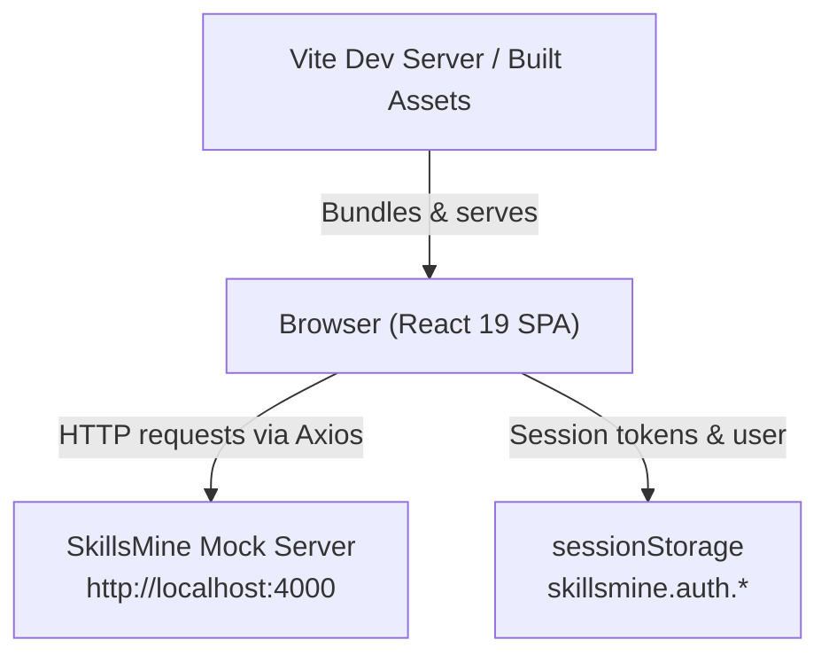
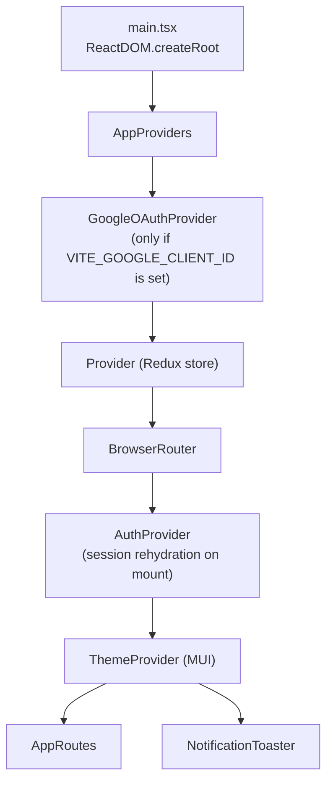
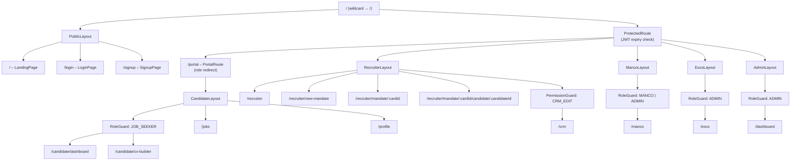
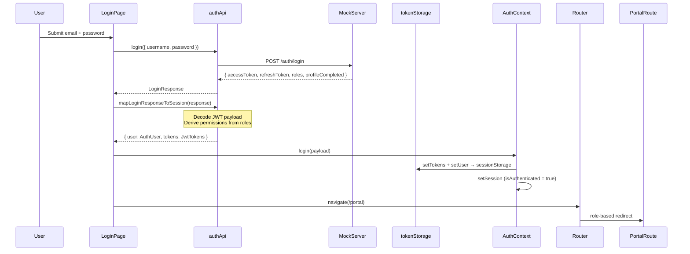
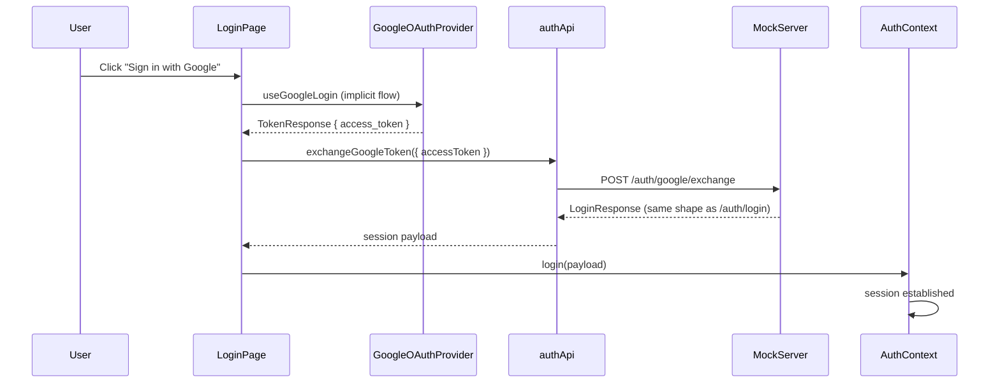
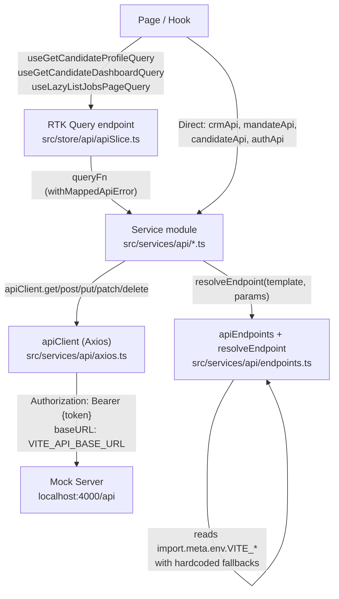
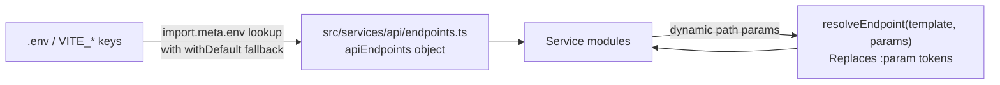
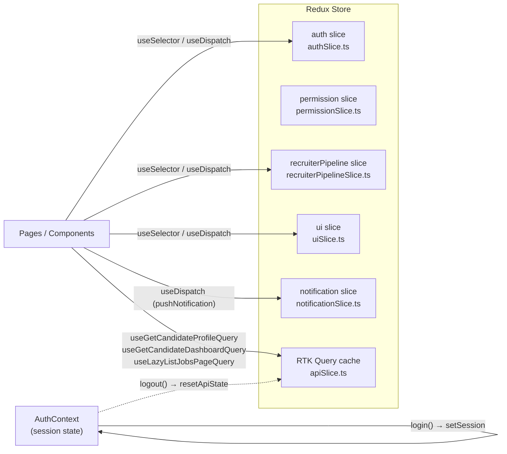
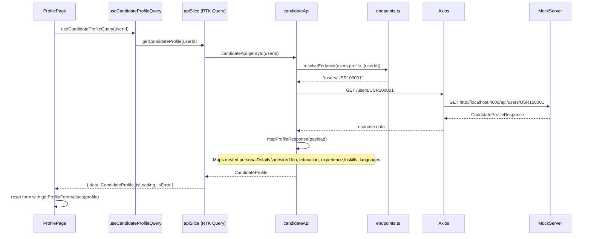
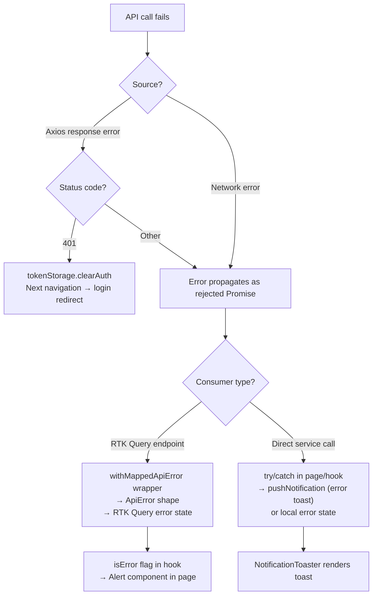

# SkillsMine Frontend – Architecture Reference

> **Audience:** developers contributing to or onboarding into this codebase.
> This document describes the current runtime architecture, API contract integration, state management decisions, route guards, auth session model, and environment configuration system.

---

## Table of Contents

1. [High-Level System Overview](#1-high-level-system-overview)
2. [Application Bootstrap](#2-application-bootstrap)
3. [Route Architecture & Access Guards](#3-route-architecture--access-guards)
4. [Auth System](#4-auth-system)
5. [API Layer Architecture](#5-api-layer-architecture)
6. [Endpoint Configuration System](#6-endpoint-configuration-system)
7. [State Management](#7-state-management)
8. [Module Structure](#8-module-structure)
9. [Data Flow: Candidate Profile](#9-data-flow-candidate-profile)
10. [Data Flow: Login & Session Establishment](#10-data-flow-login--session-establishment)
11. [Environment Variable Catalog](#11-environment-variable-catalog)
12. [Error Handling Strategy](#12-error-handling-strategy)
13. [Key Design Decisions](#13-key-design-decisions)

---

## 1. High-Level System Overview



The application is a React 19 SPA. There is no server-side rendering. All routing is client-side. The backend API base URL is configurable via `VITE_API_BASE_URL`.

---

## 2. Application Bootstrap

The app mounts in [src/main.tsx](src/main.tsx) and wraps the component tree with a single `AppProviders` composable.



**Files:**
- [`src/main.tsx`](src/main.tsx)
- [`src/app/AppProviders.tsx`](src/app/AppProviders.tsx)

`GoogleOAuthProvider` is conditionally applied — if `VITE_GOOGLE_CLIENT_ID` is absent the tree renders without it rather than crashing.

---

## 3. Route Architecture & Access Guards



### Guard Hierarchy

| Guard | File | Behaviour |
|---|---|---|
| `ProtectedRoute` | `src/routes/guards/ProtectedRoute.tsx` | Redirects to `/login` when not authenticated or JWT is expired. Preserves `from` location in state. |
| `PortalRoute` | `src/routes/PortalRoute.tsx` | On `/portal`, reads user role and immediately redirects to the role's default landing route. |
| `RoleGuard` | `src/routes/guards/RoleGuard.tsx` | Restricts a subtree to specific roles. Falls through to a configurable `fallbackPath`. |
| `PermissionGuard` | `src/routes/guards/PermissionGuard.tsx` | Restricts a subtree to specific permission tokens derived from role. |

### Role → Default Route

```
JOB_SEEKER  → /candidate/dashboard
RECRUITER   → /recruiter
MANCO       → /manco
ADMIN       → /dashboard
```

Defined in [`src/routes/roleDefaultRoutes.ts`](src/routes/roleDefaultRoutes.ts).

---

## 4. Auth System



### Session Storage Layout

| Key | Storage | Content |
|---|---|---|
| `skillsmine.auth.tokens` | `sessionStorage` | `{ accessToken, refreshToken }` |
| `skillsmine.auth.user` | `sessionStorage` | `AuthUser` object |

**Rehydration:** `AuthProvider` reads both keys on mount. If the access token is expired (checked via `isJwtExpired`), both keys are cleared and the user remains unauthenticated.

**Logout:** Clears both storage keys and resets the RTK Query cache via `apiSlice.util.resetApiState()`.

### Permission Model

Permissions are derived from roles at login time by `normalizePermissions` in [`src/services/api/authApi.ts`](src/services/api/authApi.ts). Roles → permission sets:

| Role | Permissions |
|---|---|
| `JOB_SEEKER` | VIEW_JOBS, APPLY_JOB, UPLOAD_CV, VIEW_DASHBOARD |
| `RECRUITER` | MANDATE_CREATE, MANDATE_EDIT, PIPELINE_ADVANCE, CRM_EDIT, CANDIDATE_VIEW, VIEW_DASHBOARD |
| `MANCO` | PIPELINE_VIEW, REPORT_VIEW, RECRUITER_VIEW, VIEW_DASHBOARD |
| `ADMIN` | ALL (expands to every permission) |

### Google OAuth



---

## 5. API Layer Architecture



### Axios Client Behaviour

- **Base URL:** `VITE_API_BASE_URL` (defaults to `/api`)
- **Timeout:** `VITE_REQUEST_TIMEOUT_MS` (defaults to 5000 ms)
- **Request interceptor:** Reads `skillsmine.auth.tokens` from sessionStorage and injects `Authorization: Bearer` header when present
- **Response interceptor:** On HTTP 401, calls `tokenStorage.clearAuth()` — no redirect (redirect is handled by route guard on next navigation)

File: [`src/services/api/axios.ts`](src/services/api/axios.ts)

### Service Modules

| Module | Endpoints covered |
|---|---|
| `authApi.ts` | register, login, googleExchange, forgotPassword, changePassword, logout |
| `candidateApi.ts` | users profile (get/update/photo), candidate dashboard, buildMyCv, resume preview/download, recommended jobs, application CV upload, application stage transition |
| `jobsApi.ts` | list jobs (paginated), getById, save, apply, create |
| `mandateApi.ts` | recruiter dashboard, mandate CRUD, application stage update, candidate search, ATS profile, pipeline advance, MANCO dashboard, recruiter performance |
| `crmApi.ts` | list clients, add note |

---

## 6. Endpoint Configuration System

All API endpoint strings are resolved at startup from environment variables. Hardcoded string fallbacks are provided so the app works with no extra env configuration (e.g., in CI).



### `resolveEndpoint` usage

```ts
// Template from env: '/users/:userId'
resolveEndpoint(apiEndpoints.users.profile, { userId: '123' })
// → '/users/123'

// Template from env: '/v1/pipeline/:pipelineId/stage'
resolveEndpoint(apiEndpoints.pipeline.stageUpdate, { pipelineId: 'p-42' })
// → '/v1/pipeline/p-42/stage'
```

Path params are `encodeURIComponent`-encoded. Templates with no dynamic segments are passed through unchanged.

File: [`src/services/api/endpoints.ts`](src/services/api/endpoints.ts)

### `apiEndpoints` Structure

```
apiEndpoints
├── auth        register / login / forgotPassword / changePassword / logout / googleExchange
├── users       profile / profilePhoto
├── candidate   dashboard / buildMyCv / resumePreview / resumeDownload / recommendedJobs
├── applications cvUpload / stageTransition / recruiterStageUpdate
├── jobs        list / details / save / apply / listQueryParam / listPageParam / listLimitParam
├── recruiter   dashboard / mandates / candidatesSearch / mandateDetail / candidateProfile
├── pipeline    stageUpdate
├── manco       dashboard / recruiterPerformance
└── crm         clients / clientNotes / statusParam
```

---

## 7. State Management



### Slice Summary

| Slice | Purpose | Key actions |
|---|---|---|
| `auth` | Legacy auth flags | — |
| `permission` | Permission token set | — |
| `recruiterPipeline` | Recruiter mock pipeline state (mandates, candidates, stage counts) | `selectMandate`, `moveCandidateToStage`, `addRecruiterNote`, `addDocument` |
| `ui` | Landing mode toggle (candidate vs recruiter) | `setLandingMode` |
| `notification` | Toast notification queue | `pushNotification`, `dismissNotification` |
| `api` (RTK Query) | Server cache for profile, dashboard, jobs | auto-generated hooks |

### RTK Query Endpoints

| Endpoint | Tag | Usage |
|---|---|---|
| `getCandidateProfile(userId)` | `CandidateProfile:{userId}` | ProfilePage, CvBuilderPage |
| `getCandidateDashboard()` | `CandidateDashboard:SELF` | CandidateDashboardPage |
| `updateCandidateProfile({userId, payload})` | Invalidates profile + dashboard | ProfilePage save |
| `listJobsPage({searchQuery, page, pageSize})` | `Jobs:{query}:{page}:{pageSize}` | LandingPage, JobsPage |

---

## 8. Module Structure

```
src/
├── app/                    Application-level providers, auth context, validation schemas
│   ├── auth/               AuthContext, jwt utilities, tokenStorage
│   └── validation.schema.ts  Shared Zod schemas (email, signup)
├── assets/                 Static images/icons per feature domain
├── components/             Shared UI primitives (PasswordVisibilityAdornment, NotificationToaster, placeholders)
├── hooks/                  Shared React hooks (useDebouncedValue, useSearchQueryState, useZodForm)
├── layouts/                Layout shells per role (PublicLayout, CandidateLayout, RecruiterLayout, etc.)
├── modules/                Feature modules (one directory per domain)
│   ├── auth/               Login, Signup pages + form types
│   ├── candidate/          Dashboard, Profile, Jobs pages + hooks + services + types
│   ├── crm/                CRM page (clients list + note creation)
│   ├── cv-builder/         Multi-step CV builder, preview, review + hooks
│   ├── dashboard/          Admin dashboard entry placeholder
│   ├── exco/               Exco placeholder
│   ├── manco/              MANCO placeholder
│   ├── mandates/           Mandate-related types
│   ├── pipeline/           Pipeline types
│   ├── public/             Landing page, sign-up drawers, public jobs search hooks
│   ├── recruiter/          Recruiter dashboard, mandate detail, new mandate, candidate profile
│   ├── reports/            Reports placeholder
│   └── skills-builder/     Skills builder placeholder
├── routes/                 Route definitions, guards (ProtectedRoute, RoleGuard, PermissionGuard), PortalRoute
├── services/               API transport layer
│   └── api/                axios client, endpoint config, all service modules
├── store/                  Redux store, slices, RTK Query slice, thunks, selectors
├── test/                   Vitest setup
├── theme/                  MUI theme tokens (colors, spacing, typography)
├── types/                  Shared TypeScript types (api.ts, auth.ts, common.ts, jobs.ts)
├── vite-env.d.ts           ImportMetaEnv declarations for all VITE_* keys
└── workflow/               Workflow config and service (pipeline stage definitions)
```

---

## 9. Data Flow: Candidate Profile



**Save flow** follows the reverse path: form values → `getCandidateProfileUpdatePayload` → `saveProfileThunk` → `updateCandidateProfile` mutation → `PUT /users/:userId` → invalidates profile + dashboard cache.

---

## 10. Data Flow: Login & Session Establishment

```mermaid
flowchart TD
    A([User submits login form]) --> B[authApi.login]
    B --> C[POST /auth/login]
    C --> D{Response OK?}
    D -- No --> E[Show error alert]
    D -- Yes --> F[mapLoginResponseToSession]
    F --> G["decodeJwtPayload(accessToken)\nExtract: userId, email, firstName,\nlastName, recruiterId"]
    G --> H[normalizePermissions from roles]
    H --> I[AuthContext.login payload]
    I --> J[tokenStorage.setTokens + setUser\n→ sessionStorage]
    I --> K[setSession → isAuthenticated = true]
    K --> L[navigate /portal]
    L --> M[PortalRoute reads user.role]
    M --> N{Role?}
    N -- JOB_SEEKER --> O[/candidate/dashboard]
    N -- RECRUITER --> P[/recruiter]
    N -- MANCO --> Q[/manco]
    N -- ADMIN --> R[/dashboard]
```

---

## 11. Environment Variable Catalog

All variables are declared in [`src/vite-env.d.ts`](src/vite-env.d.ts) and resolved via [`src/services/api/endpoints.ts`](src/services/api/endpoints.ts).

| Variable | Description | Default fallback |
|---|---|---|
| `VITE_GOOGLE_CLIENT_ID` | Google OAuth Web Client ID | (optional — OAuth disabled if absent) |
| `VITE_API_BASE_URL` | Backend API base URL | `/api` |
| `VITE_REQUEST_TIMEOUT_MS` | Axios timeout in ms | `5000` |
| `VITE_MOCK_ERROR_RATE` | Mock server error injection rate | `0.02` |
| `VITE_MOCK_DELAY_MIN_MS` | Mock server min response delay | `300` |
| `VITE_MOCK_DELAY_MAX_MS` | Mock server max response delay | `900` |
| `VITE_AUTH_REGISTER_ENDPOINT` | POST register | `/auth/register` |
| `VITE_AUTH_LOGIN_ENDPOINT` | POST login | `/auth/login` |
| `VITE_AUTH_FORGOT_PASSWORD_ENDPOINT` | POST forgot password | `/auth/forgot-password` |
| `VITE_AUTH_CHANGE_PASSWORD_ENDPOINT` | POST change password | `/auth/change-password` |
| `VITE_AUTH_LOGOUT_ENDPOINT` | POST logout | `/auth/logout` |
| `VITE_AUTH_GOOGLE_EXCHANGE_ENDPOINT` | POST Google token exchange | `/auth/google/exchange` |
| `VITE_AUTH_ME_ENDPOINT` | GET current user | `/auth/me` |
| `VITE_USERS_PROFILE_ENDPOINT` | GET/PUT user profile | `/users/:userId` |
| `VITE_USERS_PROFILE_PHOTO_ENDPOINT` | POST/DELETE profile photo | `/users/:userId/profile-photo` |
| `VITE_CANDIDATE_DASHBOARD_ENDPOINT` | GET candidate dashboard | `/candidate/dashboard` |
| `VITE_CANDIDATE_BUILDMYCV_ENDPOINT` | POST build my CV | `/candidate/buildmycv` |
| `VITE_CANDIDATE_RESUME_PREVIEW_ENDPOINT` | GET resume preview | `/candidate/:resumeId/preview` |
| `VITE_CANDIDATE_RESUME_DOWNLOAD_ENDPOINT` | GET resume download | `/candidate/:resumeId/download` |
| `VITE_CANDIDATE_RECOMMENDED_JOBS_ENDPOINT` | GET recommended jobs | `/candidate/:candidateId/recommended-jobs` |
| `VITE_APPLICATION_CV_UPLOAD_ENDPOINT` | POST CV upload | `/applications/:applicationId/cv/upload` |
| `VITE_JOBS_ENDPOINT` | GET/POST jobs | `/jobs` |
| `VITE_JOB_DETAILS_ENDPOINT` | GET job by ID | `/jobs/:jobId` |
| `VITE_JOB_SAVE_ENDPOINT` | POST save job | `/jobs/:jobId/save` |
| `VITE_JOB_APPLY_ENDPOINT` | POST apply to job | `/jobs/:jobId/apply` |
| `VITE_OPPORTUNITIES_ENDPOINT` | GET public opportunities | `/opportunities` |
| `VITE_JOBS_QUERY_PARAM` | Search query param name | `q` |
| `VITE_JOBS_PAGE_PARAM` | Page param name | `page` |
| `VITE_JOBS_LIMIT_PARAM` | Limit param name | `limit` |
| `VITE_SKILLS_SEARCH_ENDPOINT` | GET skills search | `/skills/search` |
| `VITE_RECRUITER_DASHBOARD_ENDPOINT` | GET recruiter dashboard | `/recruiter/dashboard` |
| `VITE_RECRUITER_MANDATES_ENDPOINT` | GET/POST mandates | `/recruiter/mandates` |
| `VITE_RECRUITER_APPLICATION_STAGE_ENDPOINT` | PUT application stage | `/recruiter/applications/:applicationId/stage` |
| `VITE_RECRUITER_CANDIDATES_SEARCH_ENDPOINT` | GET candidates search | `/recruiter/candidates/search` |
| `VITE_MANDATE_DETAIL_ENDPOINT` | GET mandate detail | `/mandates/:mandateId` |
| `VITE_APPLICATION_STAGE_TRANSITION_ENDPOINT` | GET stage transition | `/applications/:applicationId/stage-transition` |
| `VITE_RECRUITER_CANDIDATE_PROFILE_ENDPOINT` | GET ATS candidate profile | `/v1/candidates/:candidateId/profile` |
| `VITE_PIPELINE_STAGE_UPDATE_ENDPOINT` | PATCH pipeline stage | `/v1/pipeline/:pipelineId/stage` |
| `VITE_MANCO_DASHBOARD_ENDPOINT` | GET MANCO dashboard | `/v1/manco/:mancoId/dashboard` |
| `VITE_MANCO_RECRUITER_PERFORMANCE_ENDPOINT` | GET recruiter performance | `/v1/manco/recruiters/:id/performance` |
| `VITE_CRM_CLIENTS_ENDPOINT` | GET CRM clients | `/v1/crm/clients` |
| `VITE_CRM_CLIENT_NOTES_ENDPOINT` | POST CRM client note | `/v1/crm/clients/:clientId/notes` |
| `VITE_CRM_STATUS_PARAM` | CRM status query param name | `status` |

---

## 12. Error Handling Strategy



**`withMappedApiError`** (`src/store/api/queryHelpers.ts`) wraps async service calls and translates Axios errors into the `ApiError` shape RTK Query understands.

**Profile and dashboard pages** show inline `<Alert severity="error">` on load failure and disable save actions until data is ready.

---

## 13. Key Design Decisions

### RTK Query + Axios coexistence

RTK Query is used for the three most frequently cached entities (candidate profile, candidate dashboard, jobs list). Direct Axios service calls are used everywhere else. This avoids over-caching entities like mandate submission or CRM notes while still getting automatic cache invalidation on profile saves.

### Session-only token storage

Auth tokens are stored in `sessionStorage` (not `localStorage`) so they are cleared automatically when the tab is closed. This avoids stale session issues between devices and reduces the risk of XSS credential theft across sessions.

### Env-driven endpoint config with hardcoded fallbacks

Every endpoint URL is resolved from `VITE_*` env keys via `apiEndpoints` in `endpoints.ts`. Hardcoded fallbacks mirror the mock server contract, so the app works out of the box without a `.env` file and also makes endpoint drift immediately visible when keys diverge.

### Permission derivation at login, not per-request

Permissions are expanded from roles once at login time and stored on the `AuthUser` object. Guards (`PermissionGuard`, `RoleGuard`) read from React context synchronously, avoiding async permission checks on every render.

### Stage mapping telemetry

The candidate dashboard stage-to-status and stage-to-pipeline mapping uses explicit lookup tables with a `console.warn` on unknown stage values (logged once per unknown stage via a `Set`). This surfaces new backend stage values in development without crashing the UI.
