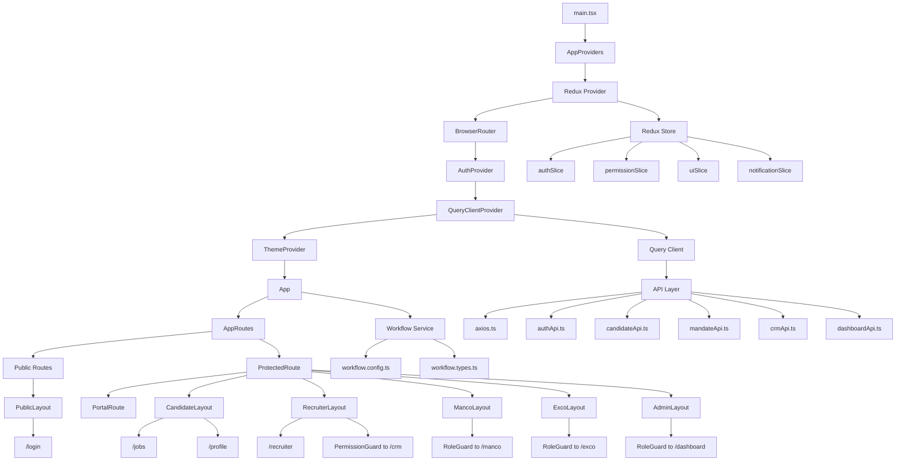

# SkillsMine Frontend

Enterprise React foundation for SkillsMine, built for scale-first development rather than feature-first prototyping.

This repository currently provides the application shell, route composition, auth boundaries, state management, API contracts, workflow engine, theming, and testing setup. Business screens and feature implementations are intentionally placeholder-only at this stage.

## Stack

- React 19
- TypeScript
- Vite
- Redux Toolkit + React Redux
- TanStack Query
- React Router v7
- Axios
- Material UI
- React Hook Form + Zod
- Vitest + React Testing Library

## Getting Started

```bash
npm install
npm run dev
```

Useful scripts:

```bash
npm run build
npm run test
npm run test:watch
npm run test:coverage
```

## Architecture Overview

The app is organized around a few explicit responsibilities:

- `app/` boots providers and global runtime wiring.
- `routes/` defines navigation, guards, and layout composition.
- `layouts/` owns shared shells and renders matched child pages through `Outlet`.
- `modules/` is the future feature surface, split by domain.
- `services/api/` contains transport contracts and Axios setup.
- `store/` owns global Redux state.
- `workflow/` contains configuration-driven stage transitions.
- `theme/` centralizes Material UI design tokens.

## High-Level Diagram



## Runtime Flow

### 1. Application boot

`main.tsx` mounts the app and wraps it with `AppProviders`.

Provider order is:

1. Redux Provider
2. BrowserRouter
3. AuthProvider
4. QueryClientProvider
5. Material UI ThemeProvider

This order matters because route guards need router context, feature code needs auth context, and all rendered UI needs theme context.

### 2. Routing and layout composition

`AppRoutes.tsx` controls which page renders and which shell wraps it.

Example: `/dashboard`

1. `ProtectedRoute` verifies the user is authenticated.
2. `RoleGuard` verifies the user has the `admin` role.
3. `AdminLayout` renders the shared admin shell.
4. `DashboardEntryPage` is injected into `AdminLayout` through `Outlet`.

This means feature pages do not import their own layouts directly. Route composition decides that relationship.

### 3. Authentication model

Current auth foundation includes:

- `AuthContext` and `useAuth()`
- JWT token helpers
- Axios request interceptor
- Route-level auth and authorization guards

Supported roles:

- `candidate`
- `recruiter`
- `manco`
- `exco`
- `admin`

Supported permissions:

- `MANDATE_CREATE`
- `MANDATE_EDIT`
- `PIPELINE_ADVANCE`
- `PIPELINE_VIEW`
- `CRM_VIEW`
- `CRM_EDIT`
- `REPORT_VIEW`

Note: the current token storage implementation is a scaffold. For production, prefer refresh tokens in `HttpOnly` cookies and short-lived access tokens in memory.

### 4. State management

Redux is used for global cross-cutting UI and identity state:

- `authSlice`: session state
- `permissionSlice`: granted permissions
- `uiSlice`: layout/global loading/theme preference state
- `notificationSlice`: global notification queue

TanStack Query is used for server-state concerns:

- request lifecycle
- caching
- retries
- future polling and stale-time control

Rule of thumb:

- Use Redux for app state.
- Use Query for server state.

### 5. API layer

`services/api/` is intentionally contract-first.

- `axios.ts` creates the shared client and interceptors.
- `authApi.ts`, `candidateApi.ts`, `mandateApi.ts`, `crmApi.ts`, `dashboardApi.ts` define typed request/response contracts.

There is no business logic in this layer yet. That is deliberate.

### 6. Workflow engine

The workflow engine is configuration-driven rather than page-driven.

Stages:

- `INBOUND`
- `SCREENING`
- `ASSESSMENT`
- `INTERVIEW`
- `SHORTLIST`
- `OFFER`
- `CLOSED`

`workflow.service.ts` reads the transition map from `workflow.config.ts`, which means stage rules can evolve without being buried inside UI components.

## Folder Structure

```text
src/
  app/
  components/
  hooks/
  layouts/
  modules/
    auth/
    dashboard/
    candidate/
    recruiter/
    mandates/
    pipeline/
    crm/
    applications/
    cv-builder/
    skills-builder/
    reports/
    manco/
    exco/
  routes/
  services/
    api/
  store/
  theme/
  types/
  workflow/
```

Each module contains the same internal scaffold:

```text
components/
pages/
services/
hooks/
types/
routes/
```

## Current Route Map

| Path | Access | Layout | Target Page |
| --- | --- | --- | --- |
| `/login` | Public | `PublicLayout` | `LoginPage` |
| `/jobs` | Authenticated | `CandidateLayout` | `JobsPage` |
| `/profile` | Authenticated | `CandidateLayout` | `ProfilePage` |
| `/recruiter` | Authenticated | `RecruiterLayout` | `RecruiterPage` |
| `/crm` | Authenticated + `CRM_VIEW` | `RecruiterLayout` | `CrmPage` |
| `/manco` | Role: `manco` or `admin` | `MancoLayout` | `MancoPage` |
| `/exco` | Role: `exco` or `admin` | `ExcoLayout` | `ExcoPage` |
| `/dashboard` | Role: `admin` | `AdminLayout` | `DashboardEntryPage` |

## Testing

Vitest is configured through `vite.config.ts` and uses:

- `jsdom` environment
- React Testing Library
- `@testing-library/jest-dom`

The first sample test lives under the placeholder component test suite and proves the base setup is working.

## Learning Sandbox

This repository includes a local-only learning area:

- `.learning-workspace/`

It is ignored by Git and intended for:

- personal notes
- scratch experiments
- architecture practice before changing `src/`

## Next Implementation Steps

When feature development starts, the next expected additions are:

1. Real login and session refresh flow
2. Module-level route registries
3. Feature service implementations behind the API contracts
4. Shared `renderWithProviders` test helper
5. CV builder schemas, preview contracts, and PDF export flow
