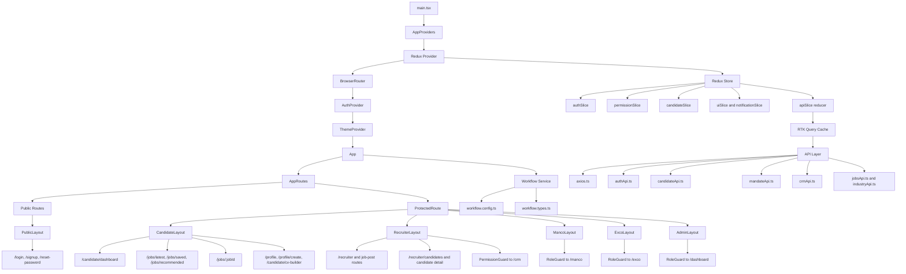

# SkillsMine Frontend

Enterprise React foundation for SkillsMine, built for scale-first development with production-minded auth and reusable UI primitives.

This repository provides the application shell, route composition, auth boundaries, state management, API contracts, workflow engine, theming, and test setup. It includes public and candidate-facing authentication UX, email sign-up flow scaffolding, Google OAuth sign-in entry, shared navigation, and role-specific layout components.

> For the full runtime architecture, route guards, API integration, state ownership, data flows, environment catalog, and design decisions, see [ARCHITECTURE.md](ARCHITECTURE.md).

## Stack

- React 19
- TypeScript
- Vite 8
- Redux Toolkit + React Redux
- RTK Query
- React Router v7
- Axios
- Material UI
- Google OAuth (`@react-oauth/google`)
- React Hook Form + Zod
- Vitest + React Testing Library

## Getting Started

```bash
npm install
npm run dev
```

Create a local `.env` file when you need to point the app at a backend or enable Google sign-in:

```dotenv
VITE_API_BASE_URL=http://localhost:4000/api
VITE_GOOGLE_CLIENT_ID=your-google-web-client-id
VITE_DOCUMENTS_UPLOAD_RESUME_ENDPOINT=/documents/resume
```

`VITE_API_BASE_URL` defaults to `/api`. `VITE_GOOGLE_CLIENT_ID` is optional; when it is absent, the app still runs and Google sign-in reports that OAuth configuration is unavailable. All endpoint-specific `VITE_*` keys have hardcoded fallbacks matching the mock-server contract and are optional. See [ARCHITECTURE.md](ARCHITECTURE.md) for the full environment variable catalog.

Useful scripts:

```bash
npm run build
npm run lint
npm run test
npm run test:watch
npm run test:coverage
npm run preview
```

## What Changed Recently

### Recruiter Sign-Up Flow

- Added recruiter-specific sign-up submission through the staff/recruiter registration API boundary rather than treating recruiter registration as candidate registration.
- The `Find Candidates` landing-page CTA opens the recruiter sign-up drawer when the page is in `startHiring` mode.
- `PublicLayout` conditionally renders the candidate or recruiter sign-up experience based on landing mode.

### Authentication and OAuth

- Added Google OAuth support with conditional provider registration in app providers.
- Refactored auth persistence so JWT tokens and authenticated user data are stored and cleared together in session storage.
- `AuthProvider` hydrates state from storage on boot, clears invalid sessions, and persists user data on login.
- JWT expiry checks treat tokens without an `exp` claim as expired.
- Candidate onboarding routes from login based on profile completeness. `JOB_SEEKER` users with incomplete profiles go to `/profile/create`; complete profiles go to `/candidate/dashboard`.
- The old active `/portal` hop was removed to avoid auth hydration races and redirects back to `/login` after successful login.
- `ProtectedRoute` and `RoleGuard` use valid persisted session data as a temporary fallback during auth hydration.
- Public auth routes include `/login`, `/signup`, and `/reset-password`.

### Public, Candidate, and Shared Navigation

- Candidate layout uses shared public header and footer composition.
- Header navigation is generated from role-aware presets and protected links redirect unauthenticated users to login.
- Added profile menu behavior, profile settings access, sign out, notification affordances, and authenticated logo routing.
- Candidate navigation exposes dashboard, latest opportunities, saved jobs, recommended jobs, profile, and CV builder destinations.
- Jobs-feed back navigation returns to the candidate dashboard.

### Candidate Dashboard and Jobs

- Added the candidate dashboard with summary metrics, application activity, profile completion, CV actions, and recommended-job navigation.
- Added latest, saved, and recommended job feeds plus job details navigation.
- Jobs feeds support debounced search with a three-character minimum, paginated infinite scrolling for latest jobs, and loading, empty, and error states.
- Added optimistic save/unsave behavior for job cards and job details.
- Saved and recommended job IDs are kept in the candidate Redux slice and hydrated from candidate dashboard/profile responses.

### Recruiter Job Posts and Candidates

- Added recruiter job-post listing, creation, editing, detail, and deletion flows.
- Job-post endpoints are configured independently from legacy recruiter mandate endpoints.
- Added industry catalog loading with autocomplete support in the job-post form.
- Added recruiter candidate directory and dedicated candidate detail screens.
- Current recruiter paths include `/recruiter/job-posts`, `/recruiter/new-job-post`, `/recruiter/edit-job-post/:mandateId`, `/recruiter/candidates`, and `/recruiter/candidates/:candidateId`.
- Legacy frontend paths such as `/recruiter/mandates` and `/recruiter/new-mandate` are no longer active route paths.

### Form UX and Validation

- Added candidate sign-up validation for name fields, email, South African 9-digit phone format, password length, password confirmation, password hint, and terms acceptance.
- Added reusable password visibility adornment for password inputs.

### Reusable Hooks and Utilities

- Added `useDebouncedValue` for delayed value updates.
- Added `useSearchQueryState` to unify search input state, normalization, debounce handling, and minimum-character query gating.

### Branding and Styling

- Updated favicon and typography loading.
- Refined public layout styling for navigation, action buttons, profile menu, and responsive behavior.

### Dependency and Script Cleanup

- Added `@react-oauth/google`.
- Removed unused `httpyac` tooling and scripts.
- Removed `@tanstack/react-query` after migrating server-state flows to RTK Query.

### Server-State Architecture Migration

- Migrated selected server-state operations to RTK Query with a centralized API slice at `src/store/api/apiSlice.ts`.
- `apiSlice` handles candidate profile/dashboard queries, user profile state, skills search, CV state, mutations, and paginated jobs reads.
- Moved cache invalidation to tag-based policies using `providesTags` and `invalidatesTags`.
- Logout resets server cache through `apiSlice.util.resetApiState()`.
- Candidate profile/application Redux mirror state was removed where RTK Query is now the source of truth.

### CV Documents, Opportunity Search, and Recruiter Workflow

- CV Builder completion now saves the structured CV, generates an A4 PDF from the saved payload, and uploads the document through the RTK Query `uploadCvResumeDocument` mutation.
- Generated resume filenames include sanitized first and last names, the uploader role, and a UTC timestamp. A failed document upload warns the user while preserving the successfully saved CV.
- Added the candidate opportunity search modal with debounced, minimum-length search behavior and responsive job-card layouts.
- Recruiter pipeline cards now support drag-and-drop stage changes with responsive layout handling.
- Added CV upload modal validation for PDF, DOC, and DOCX files.

## Architecture Overview

The app is organized around explicit responsibilities:

- `app/` boots providers and global runtime wiring.
- `routes/` defines navigation, guards, and layout composition.
- `layouts/` owns shared shells and renders matched child pages through `Outlet`.
- `modules/` contains domain pages, hooks, services, and types.
- `services/api/` contains transport contracts, endpoint configuration, response mapping, and Axios setup.
- `store/` owns global Redux state and the RTK Query API slice.
- `workflow/` contains configuration-driven pipeline stage transitions.
- `theme/` centralizes Material UI design tokens.

## High-Level Diagram


```mermaid
flowchart TD
    A[main.tsx] --> B[AppProviders]
    B --> B1[Redux Provider]
    B1 --> B2[BrowserRouter]
    B2 --> B3[AuthProvider]
    B3 --> B4[ThemeProvider]
    B4 --> C[App]
    C --> D[AppRoutes]

    D --> E[Public Routes]
    D --> F[ProtectedRoute]
    E --> E1[PublicLayout]
    E1 --> E2["/login, /signup, /reset-password"]

    F --> H[CandidateLayout]
    F --> I[RecruiterLayout]
    F --> J[MancoLayout]
    F --> K[ExcoLayout]
    F --> L[AdminLayout]

    H --> H1["/candidate/dashboard"]
    H --> H2["/jobs/latest, /jobs/saved, /jobs/recommended"]
    H --> H3["/jobs/:jobId"]
    H --> H4["/profile, /profile/create, /candidate/cv-builder"]
    I --> I1["/recruiter and job-post routes"]
    I --> I2["/recruiter/candidates and candidate detail"]
    I --> I3["PermissionGuard to /crm"]
    J --> J1["RoleGuard to /manco"]
    K --> K1["RoleGuard to /exco"]
    L --> L1["RoleGuard to /dashboard"]

    B1 --> M[Redux Store]
    M --> M1[authSlice]
    M --> M2[permissionSlice]
    M --> M3[candidateSlice]
    M --> M4[uiSlice and notificationSlice]
    M --> M5[apiSlice reducer]
    M5 --> N[RTK Query Cache]
    N --> O[API Layer]
    O --> O1[axios.ts]
    O --> O2[authApi.ts]
    O --> O3[candidateApi.ts]
    O --> O4[mandateApi.ts]
    O --> O5[crmApi.ts]
    O --> O6[jobsApi.ts and industryApi.ts]
    C --> P[Workflow Service]
    P --> P1[workflow.config.ts]
    P --> P2[workflow.types.ts]
```

## Runtime Flow

### 1. Application boot

`main.tsx` mounts the app and wraps it with `AppProviders`.

Provider order is:

1. Redux Provider
2. BrowserRouter
3. AuthProvider
4. Material UI ThemeProvider and `CssBaseline`
5. Application routes and `NotificationToaster`

This order matters because route guards need router context, feature code needs auth context, and all rendered UI needs theme context. `GoogleOAuthProvider` is added outside this tree only when `VITE_GOOGLE_CLIENT_ID` is configured.

### 2. Routing and layout composition

`AppRoutes.tsx` controls which page renders and which shell wraps it. Feature pages are lazy-loaded under a shared `Suspense` fallback.

Example: `/dashboard`

1. `ProtectedRoute` verifies the user is authenticated.
2. `RoleGuard` verifies the user has the `ADMIN` role.
3. `AdminLayout` renders the shared admin shell.
4. `DashboardEntryPage` is injected into `AdminLayout` through `Outlet`.

Feature pages do not import their own layouts directly. Route composition decides that relationship. The detailed route hierarchy and guard relationships are documented in [ARCHITECTURE.md](ARCHITECTURE.md).

### 3. Authentication model

Current auth foundation includes:

- `AuthContext` and `useAuth()`
- JWT decoding and expiry validation
- Axios request and response interceptors
- Route-level authentication and authorization guards
- Session-storage-backed token and user persistence
- Google token exchange when OAuth is configured

Supported roles:

- `JOB_SEEKER`
- `RECRUITER`
- `MANCO`
- `EXCO`
- `ADMIN`

Permissions are derived from roles during login. Current role mappings include:

- `JOB_SEEKER`: `VIEW_JOBS`, `APPLY_JOB`, `UPLOAD_CV`, `VIEW_DASHBOARD`
- `RECRUITER`: `MANDATE_CREATE`, `MANDATE_EDIT`, `PIPELINE_ADVANCE`, `CRM_EDIT`, `CANDIDATE_VIEW`, `VIEW_DASHBOARD`
- `MANCO` and `EXCO`: `PIPELINE_VIEW`, `REPORT_VIEW`, `RECRUITER_VIEW`, `VIEW_DASHBOARD`
- `ADMIN`: all known permissions

The current persistence uses browser session storage for both tokens and user profile. For hardened production environments, prefer refresh tokens in `HttpOnly` cookies and short-lived access tokens in memory.

### 4. State management

Redux is used for global cross-cutting UI, identity, and workflow state:

- `authSlice`: compatibility/auth state
- `permissionSlice`: permission state
- `candidateSlice`: candidate identity, saved/recommended job IDs, and profile/CV flags
- `recruiterPipelineSlice`: recruiter pipeline selections, stages, notes, and documents
- `uiSlice`: cross-cutting UI state such as landing mode
- `notificationSlice`: global notification queue

RTK Query is used for server-state concerns through `apiSlice`:

- request lifecycle
- caching
- cache invalidation through tags
- optimistic updates where needed
- lazy and standard generated hooks
- paginated job reads

Rule of thumb:

- Use Redux slices for UI, workflow, and cross-page client state.
- Use RTK Query endpoints for server data and cache lifecycle.
- Do not create a second Redux mirror for data already owned by RTK Query.

### 5. API layer

`services/api/` is intentionally contract-first:

- `axios.ts` creates the shared client, applies the base URL and timeout, and attaches the bearer token.
- `endpoints.ts` centralizes environment-driven endpoint templates and fallback paths.
- `authApi.ts`, `candidateApi.ts`, `jobsApi.ts`, `mandateApi.ts`, `industryApi.ts`, `recruiterCandidatesApi.ts`, and `crmApi.ts` define typed request/response operations and backend mapping.
- `store/api/apiSlice.ts` composes selected service contracts into cache-aware generated RTK Query hooks.

There is no page-level scattering of backend URL strings. Backend response mapping stays in service modules so UI components work with stable frontend types.

### 6. Workflow engine

The workflow engine is configuration-driven rather than page-driven. Current pipeline stages include:

- `INBOUND`
- `SCREENING`
- `ASSESSMENT`
- `INTERVIEW`
- `SHORTLIST`
- `OFFER`
- `CLOSED`

`workflow.service.ts` reads transition rules from `workflow.config.ts`, allowing stage rules to evolve without burying them inside UI components.

## Folder Structure

```text
src/
  app/                    Providers, auth context, JWT, storage, validation
    auth/                 AuthContext, auth events, JWT helpers, tokenStorage
  assets/                 Images and icons grouped by feature
  components/             Shared UI primitives and notification surfaces
  hooks/                  Shared hooks such as debounce and search state
  layouts/                Public and role-specific shells
  modules/
    auth/                 Login, sign-up, reset-password pages and forms
    candidate/            Dashboard, profile, jobs, job details, and hooks
    crm/                  CRM clients and notes
    cv-builder/           Multi-step CV builder and preview
    dashboard/            Admin dashboard entry
    exco/                 EXCO entry
    manco/                MANCO entry
    public/               Landing page, public search, and sign-up drawers
    recruiter/            Dashboard, mandates, job posts, candidates, CRM
  routes/                 Route definitions, paths, and guards
  services/api/           Axios client, endpoint config, transport modules
  store/                  Redux store, slices, selectors, RTK Query API
  test/                   Vitest setup and shared test utilities
  theme/                  Material UI design tokens
  types/                  Shared API, auth, jobs, and common contracts
  workflow/               Pipeline stage definitions and transitions
```

Each domain module may contain:

```text
components/
pages/
services/
hooks/
types/
```

Shared concerns should remain in their existing top-level owner: layouts for shells, components for reusable UI, services for backend mapping, and store for cross-page state.

## Current Route Map

| Path | Access | Layout | Target Page |
|---|---|---|---|
| `/` | Public | `PublicLayout` | `LandingPage` |
| `/login` | Public | `PublicLayout` | `LoginPage` |
| `/signup` | Public | `PublicLayout` | `SignupPage` |
| `/reset-password` | Public | `PublicLayout` | `ResetPasswordPage` |
| `/candidate/dashboard` | Authenticated + `JOB_SEEKER` | `CandidateLayout` | `CandidateDashboardPage` |
| `/candidate/cv-builder` | Authenticated + `JOB_SEEKER` | `CandidateLayout` | `CvBuilderPage` |
| `/profile/create` | Authenticated + `JOB_SEEKER` | `CandidateLayout` | `ProfileCreationPage` |
| `/jobs` | Authenticated | `CandidateLayout` | `JobsPage` |
| `/jobs/:jobId` | Authenticated | `CandidateLayout` | `JobDetailsPage` |
| `/jobs/latest` | Authenticated | `CandidateLayout` | `LatestJobsPage` |
| `/jobs/saved` | Authenticated | `CandidateLayout` | `SavedJobsPage` |
| `/jobs/recommended` | Authenticated | `CandidateLayout` | `RecommendedJobsPage` |
| `/profile` | Authenticated | `CandidateLayout` | `ProfilePage` |
| `/recruiter` | Authenticated | `RecruiterLayout` | `RecruiterPage` |
| `/recruiter/job-posts` | Authenticated | `RecruiterLayout` | `RecruiterMandatesPage` |
| `/recruiter/new-job-post` | Authenticated | `RecruiterLayout` | `NewMandatePage` |
| `/recruiter/edit-job-post/:mandateId` | Authenticated | `RecruiterLayout` | `EditMandatePage` |
| `/recruiter/mandate/:cardId` | Authenticated | `RecruiterLayout` | `MandateDetailPage` |
| `/recruiter/mandate/:cardId/candidate/:candidateId` | Authenticated | `RecruiterLayout` | `CandidateProfilePage` |
| `/recruiter/candidates` | Authenticated | `RecruiterLayout` | `CandidatesPage` |
| `/recruiter/candidates/:candidateId` | Authenticated | `RecruiterLayout` | `CandidateDetailPage` |
| `/recruiter/crm` | Authenticated | `RecruiterLayout` | `RecruiterCrmPage` |
| `/recruiter/manco` | Authenticated | `RecruiterLayout` | `RecruiterMancoPage` |
| `/crm` | Authenticated + `CRM_EDIT` | `RecruiterLayout` | `CrmPage` |
| `/manco` | `MANCO` or `ADMIN` | `MancoLayout` | `MancoPage` |
| `/exco` | `EXCO` or `ADMIN` | `ExcoLayout` | `ExcoPage` |
| `/dashboard` | `ADMIN` | `AdminLayout` | `DashboardEntryPage` |

Unknown paths redirect to `/`. Candidate and public header behavior is role-aware and route-aware, and protected navigation entries redirect unauthenticated users to login.

## Testing

Vitest is configured through `vite.config.ts` and uses:

- `jsdom` environment
- React Testing Library
- `@testing-library/jest-dom`

API modules and auth flows have colocated tests. Run the focused suite while changing a domain, then run the full checks before merging:

```bash
npm run test
npm run lint
npm run build
```

## Backend and Mock Server

The frontend can run against the SkillsMine mock server in the sibling `skills-mine-mock` project. Start that server separately, then set `VITE_API_BASE_URL` to its API base. The mock project contains route handlers, fixture data, and API documentation used by the endpoint fallbacks.

## Known Gaps / Next Steps

1. Complete backend token exchange and callback handling for Google OAuth sign-up/login flows.
2. Add refresh-token lifecycle and silent session renewal.
3. Expand module-level route registries and feature service implementations.
4. Add a shared `renderWithProviders` test helper and increase integration coverage for auth and navigation flows.
5. Continue CV builder schemas, preview contracts, and PDF export flow.

## Documentation

- [Detailed architecture reference](ARCHITECTURE.md)
- [API migration report](API_MIGRATION_REPORT.md)
