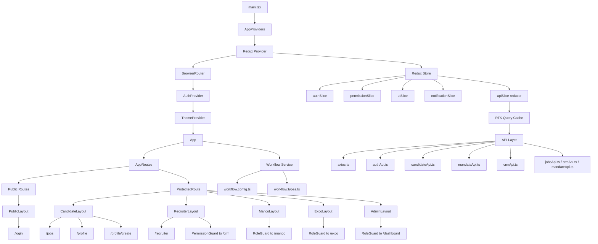

# SkillsMine Frontend

Enterprise React foundation for SkillsMine, built for scale-first development with production-minded auth and reusable UI primitives.

This repository provides the application shell, route composition, auth boundaries, state management, API contracts, workflow engine, theming, and test setup. It now also includes implemented public and candidate-facing authentication UX (email sign-up flow scaffolding and Google OAuth sign-up entry), plus improved shared navigation and layout components.

> For a full breakdown of the system architecture, API contract integration, route guards, state management design, and environment configuration, see [ARCHITECTURE.md](ARCHITECTURE.md).

## Stack

- React 19
- TypeScript
- Vite
- Redux Toolkit + React Redux
- RTK Query
- React Router v7
- Axios
- Material UI
- Google OAuth (`@react-oauth/google`)
- React Hook Form + Zod
- Vitest + React Testing Library

## Getting Started

```bash
npm install
npm run dev
```

Create a local `.env` from `.env.example` and set the required values.

Required:

1. Add `VITE_GOOGLE_CLIENT_ID` to your local `.env` file (Web client ID from Google Cloud Console).
2. Set `VITE_API_BASE_URL` to your backend API base (e.g. `http://localhost:4000/api`).

All other `VITE_*` endpoint keys have hardcoded fallbacks matching the mock server contract and are optional. See [ARCHITECTURE.md](ARCHITECTURE.md) for the full environment variable catalog.

Useful scripts:

```bash
npm run build
npm run test
npm run test:watch
npm run test:coverage
```

## What Changed Recently

### Recruiter Sign-Up Flow

- Added `recruiterSignup` method to `authApi` that calls `POST /recruiters/register` (`VITE_RECRUITER_REGISTER_ENDPOINT`), separate from the candidate sign-up endpoint.
- `useRecruiterSignUpForm` now submits to the recruiter-specific endpoint instead of the shared candidate endpoint.
- The "Find Candidates" hero CTA on the landing page now opens `RecruiterSignUpDrawer` when the page is in `startHiring` mode. `PublicLayout` already conditionally renders the correct drawer based on landing mode, so no layout changes were required.

### Authentication and OAuth

- Added Google OAuth support with conditional provider registration in app providers. If `VITE_GOOGLE_CLIENT_ID` is missing, the app still runs and the Google sign-up action gracefully falls back.
- Refactored auth persistence so both JWT tokens and authenticated user data are stored and cleared together via session storage.
- `AuthProvider` now hydrates state from storage on boot, clears invalid sessions, and persists user data on login.
- JWT expiry checks are stricter: tokens without an `exp` claim are treated as expired.
- Candidate onboarding now routes directly from login to `/profile/create` when sign-up set a pending profile-creation intent. The old active `/portal` hop was removed because it amplified auth hydration races and caused occasional redirects back to `/login` despite successful login and `/auth/me` responses.
- `ProtectedRoute` and `RoleGuard` now use persisted session storage as a temporary fallback during auth hydration so protected candidate routes do not flicker or bounce on first render.

### Public/Candidate Layout and Navigation

- Candidate layout now uses shared public header/footer composition.
- Header navigation is generated from role-aware presets and supports protected links that redirect unauthenticated users to login.
- Added profile menu behavior (profile settings + sign out), notification affordance, and improved logo routing for authenticated users.

### Form UX and Validation

- Added candidate sign-up schema with field-level validation for:
  - name fields
  - email
  - South African 9-digit phone format
  - minimum password length
  - confirm-password match
  - required password hint
  - required terms acceptance
- Added reusable password visibility adornment for password inputs.

### Reusable Hooks and Utilities

- Added `useDebouncedValue` for delayed value updates.
- Added `useSearchQueryState` to unify search input state, normalization, debounce handling, and min-character query gating.

### Branding and Styling

- Updated favicon and typography loading.
- Refined public layout styling for navigation, action buttons, profile menu, and responsive behavior.

### Dependency and Script Cleanup

- Added `@react-oauth/google`.
- Removed unused `httpyac` tooling/scripts.
- Removed `@tanstack/react-query` after migrating server-state flows to RTK Query.

### Server-State Architecture Migration

- Migrated server-state operations to `RTK Query` with a centralized API slice at `src/store/api/apiSlice.ts`.
- `apiSlice` now handles candidate profile queries, candidate applications queries, profile mutations, and paginated jobs reads.
- Moved cache invalidation logic to tag-based policies (`providesTags` / `invalidatesTags`) and removed QueryClient cache management.
- Logout now resets server cache using `apiSlice.util.resetApiState()`.
- Candidate profile/application Redux mirror slices were removed to keep a single source of truth for server data.

## Architecture Overview

The app is organized around a few explicit responsibilities:

- `app/` boots providers and global runtime wiring.
- `routes/` defines navigation, guards, and layout composition.
- `layouts/` owns shared shells and renders matched child pages through `Outlet`.
- `modules/` is the future feature surface, split by domain.
- `services/api/` contains transport contracts and Axios setup.
- `store/` owns global Redux state.
- `workflow/` contains configuration-driven stage transitions.
- `theme/` centralizes Material UI design tokens.

## High-Level Diagram


```mermaid
flowchart TD
    A[main.tsx] --> B[AppProviders]
    B --> B1[Redux Provider]
    B1 --> B2[BrowserRouter]
    B2 --> B3[AuthProvider]
    B3 --> B4[ThemeProvider]
    B4 --> C[App]
    C --> D[AppRoutes]

    D --> E[Public Routes]
    D --> F[ProtectedRoute]

    E --> E1[PublicLayout]
    E1 --> E2["/login"]

    F --> H[CandidateLayout]
    F --> I[RecruiterLayout]
    F --> J[MancoLayout]
    F --> K[ExcoLayout]
    F --> L[AdminLayout]

    H --> H1["/jobs"]
    H --> H2["/profile"]
    H --> H3["/profile/create"]
    I --> I1["/recruiter"]
    I --> I2["PermissionGuard to /crm"]
    J --> J1["RoleGuard to /manco"]
    K --> K1["RoleGuard to /exco"]
    L --> L1["RoleGuard to /dashboard"]

    B1 --> M[Redux Store]
    M --> M1[authSlice]
    M --> M2[permissionSlice]
    M --> M3[uiSlice]
    M --> M4[notificationSlice]
    M --> M5[apiSlice reducer]

    M5 --> N[RTK Query Cache]
    N --> O[API Layer]
    O --> O1[axios.ts]
    O --> O2[authApi.ts]
    O --> O3[candidateApi.ts]
    O --> O4[mandateApi.ts]
    O --> O5[crmApi.ts]
    O --> O6[jobsApi.ts / crmApi.ts / mandateApi.ts]

    C --> P[Workflow Service]
    P --> P1[workflow.config.ts]
    P --> P2[workflow.types.ts]
```

## Runtime Flow

### 1. Application boot

`main.tsx` mounts the app and wraps it with `AppProviders`.

Provider order is:

1. Redux Provider
2. BrowserRouter
3. AuthProvider
4. Material UI ThemeProvider

This order matters because route guards need router context, feature code needs auth context, and all rendered UI needs theme context.

### 2. Routing and layout composition

`AppRoutes.tsx` controls which page renders and which shell wraps it.

Example: `/dashboard`

1. `ProtectedRoute` verifies the user is authenticated.
2. `RoleGuard` verifies the user has the `admin` role.
3. `AdminLayout` renders the shared admin shell.
4. `DashboardEntryPage` is injected into `AdminLayout` through `Outlet`.

This means feature pages do not import their own layouts directly. Route composition decides that relationship.

### 3. Authentication model

Current auth foundation includes:

- `AuthContext` and `useAuth()`
- JWT token helpers with expiry-first validation
- Axios request interceptor
- Route-level auth and authorization guards
- Session storage-backed token + user persistence

Supported roles:

- `candidate`
- `recruiter`
- `manco`
- `exco`
- `admin`

Supported permissions:

- `MANDATE_CREATE`
- `MANDATE_EDIT`
- `PIPELINE_ADVANCE`
- `PIPELINE_VIEW`
- `CRM_VIEW`
- `CRM_EDIT`
- `REPORT_VIEW`

Note: current persistence uses browser session storage for both tokens and user profile. For hardened production environments, prefer refresh tokens in `HttpOnly` cookies and short-lived access tokens in memory.

### 4. State management

Redux is used for global cross-cutting UI and identity state:

- `authSlice`: session state
- `permissionSlice`: granted permissions
- `uiSlice`: layout/global loading/theme preference state
- `notificationSlice`: global notification queue

RTK Query is used for server-state concerns through `apiSlice`:

- request lifecycle
- caching
- retries
- invalidation via endpoint tags
- lazy and standard generated hooks

Rule of thumb:

- Use Redux slices for UI/app state.
- Use RTK Query endpoints for server data.

### 5. API layer

`services/api/` is intentionally contract-first.

- `axios.ts` creates the shared client and interceptors.
- `authApi.ts`, `candidateApi.ts`, `mandateApi.ts`, `crmApi.ts`, `dashboardApi.ts` define typed request/response contracts.

`store/api/apiSlice.ts` composes these service contracts into cache-aware, generated RTK Query hooks for page-level consumption.

There is no business logic in this layer yet. That is deliberate.

### 6. Workflow engine

The workflow engine is configuration-driven rather than page-driven.

Stages:

- `INBOUND`
- `SCREENING`
- `ASSESSMENT`
- `INTERVIEW`
- `SHORTLIST`
- `OFFER`
- `CLOSED`

`workflow.service.ts` reads the transition map from `workflow.config.ts`, which means stage rules can evolve without being buried inside UI components.

## Folder Structure

```text
src/
  app/
  components/
  hooks/
  layouts/
  modules/
    auth/
    dashboard/
    candidate/
    recruiter/
    mandates/
    pipeline/
    crm/
    applications/
    cv-builder/
    skills-builder/
    reports/
    manco/
    exco/
  routes/
  services/
    api/
  store/
  theme/
  types/
  workflow/
```

Each module contains the same internal scaffold:

```text
components/
pages/
services/
hooks/
types/
routes/
```

## Current Route Map

| Path | Access | Layout | Target Page |
| --- | --- | --- | --- |
| `/login` | Public | `PublicLayout` | `LoginPage` |
| `/jobs` | Authenticated | `CandidateLayout` | `JobsPage` |
| `/profile` | Authenticated | `CandidateLayout` | `ProfilePage` |
| `/recruiter` | Authenticated | `RecruiterLayout` | `RecruiterPage` |
| `/crm` | Authenticated + `CRM_VIEW` | `RecruiterLayout` | `CrmPage` |
| `/manco` | Role: `manco` or `admin` | `MancoLayout` | `MancoPage` |
| `/exco` | Role: `exco` or `admin` | `ExcoLayout` | `ExcoPage` |
| `/dashboard` | Role: `admin` | `AdminLayout` | `DashboardEntryPage` |

Candidate and public header behavior is role-aware and route-aware, and protected navigation entries trigger login redirects when no valid auth session exists.

## Testing

Vitest is configured through `vite.config.ts` and uses:

- `jsdom` environment
- React Testing Library
- `@testing-library/jest-dom`

The first sample test lives under the placeholder component test suite and proves the base setup is working.


## Known Gaps / Next Steps

1. Complete backend token exchange and callback handling for Google OAuth sign-up/login flows.
2. Add refresh-token lifecycle and silent session renewal.
3. Expand module-level route registries and feature service implementations.
4. Add a shared `renderWithProviders` test helper and increase integration test coverage for auth + navigation flows.
5. Continue CV builder schemas, preview contracts, and PDF export flow.
